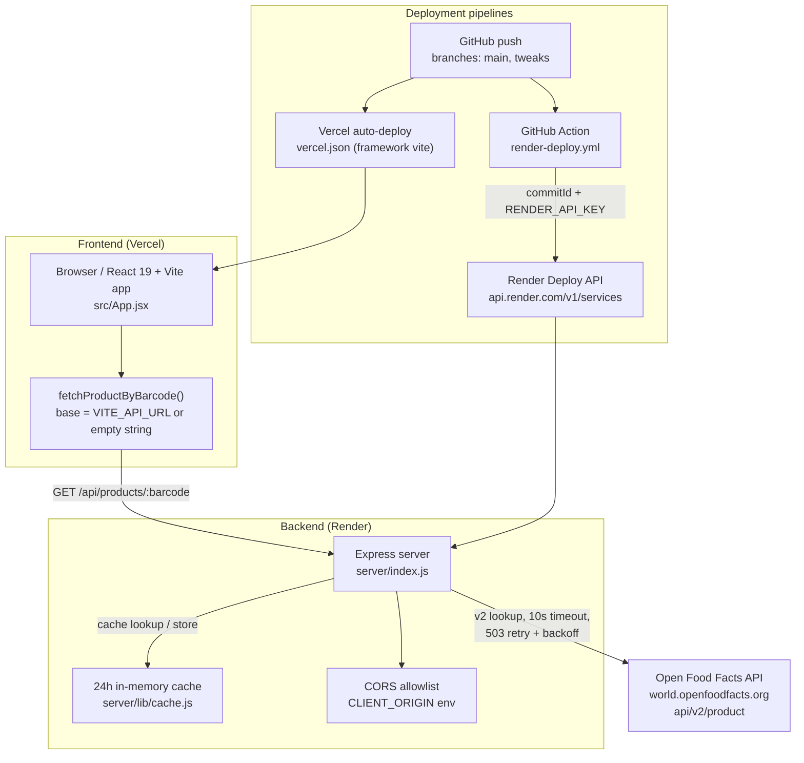
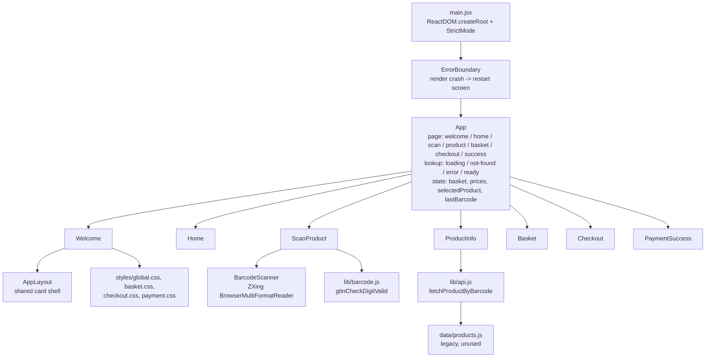
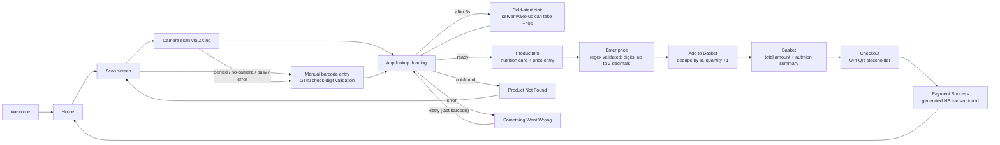
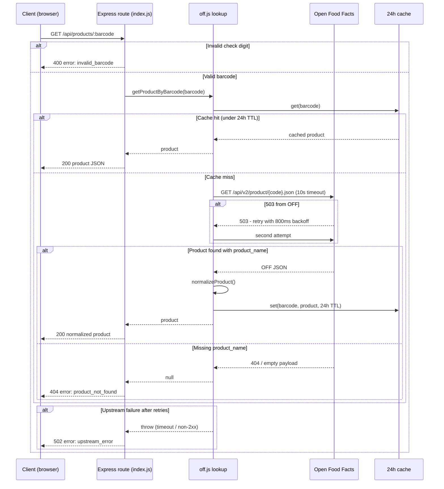
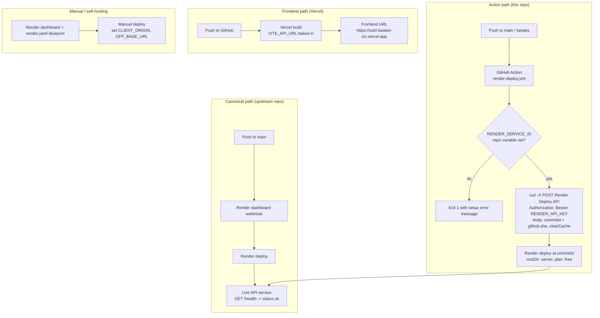

# NutriBasket — Project Diagram

NutriBasket is a smart-shopping assistant: a React 19 + Vite single-page app (deployed on Vercel) where shoppers scan or type a product barcode, fetch nutrition data from Open Food Facts through an Express API (deployed on Render), enter a price, build a basket with running nutrition totals, and complete a mock UPI checkout. This document maps the system at five levels — overall architecture, frontend components, user workflow, the backend API lifecycle, and deployment pipelines — followed by an endpoint reference table. Mermaid diagrams render natively on GitHub.

## 1. System Architecture (overview)

The browser app calls the Express backend over REST; the backend is the only component that talks to Open Food Facts (OFF). The backend keeps a 24-hour in-memory cache to absorb repeated lookups, and CORS is scoped to the frontend origin via the `CLIENT_ORIGIN` environment variable. Two independent deployment pipelines feed the frontend (Vercel) and backend (Render via GitHub Action).

## 2. Frontend Component Architecture

`main.jsx` mounts `App` inside a top-level `ErrorBoundary` (a render-crash fallback with a restart button). `App` is a pure state machine over seven pages (`page`) with a `lookup` state (`loading / not-found / error / ready`) plus `basket`, `prices`, `selectedProduct`, and `lastBarcode`; `handleScanned(barcode)` drives the lookup and routes to the product page. Screens are thin presentational components; shared pieces are the ZXing `BarcodeScanner`, the `AppLayout` shell, and the `api.js` / `barcode.js` libs. `data/products.js` is legacy and unused.

## 3. User Workflow (happy path + fallbacks)

The shopper lands on Welcome, moves through Home to the Scan screen, and either scans with the camera (ZXing) or types a barcode manually. Manual entry is GTIN-validated (8/12/13/14 digits with check digit). If the camera is denied, missing, busy, or fails, the UI falls back to manual entry. `App` then loads the product; after 5 seconds it shows a cold-start hint ("waking up the server"). Not-found and error states both route back to the scan screen (error offers Retry with the last barcode). The happy path continues: enter a price (regex `^\d+(\.\d{1,2})?$`), add to basket (deduped, quantity increments), review totals, checkout against a UPI QR placeholder, and confirm.

## 4. Backend API Lifecycle

`GET /api/products/:barcode` first validates the barcode check digit (400 `invalid_barcode` on failure). Otherwise `getProductByBarcode` checks the 24h in-memory cache first; on a miss it calls OFF via `fetchWithRetry` (10s timeout, one retry with 800ms backoff on 503). A successful response is normalized into the app's product shape and cached. A missing `product_name` maps to 404 `product_not_found`; an upstream failure after retries maps to 502 `upstream_error`.

## 5. Deployment Lifecycle

The backend is deployed two ways. The canonical path: pushing to `main` in the upstream repo triggers the Render dashboard webhook (or the GitHub Action below in the fork). The repository in this workspace uses the GitHub Action path: a push to `main` or `tweaks` runs `render-deploy.yml`, which guards on the `RENDER_SERVICE_ID` repo variable, then POSTs to the Render Deploy API with the `RENDER_API_KEY` secret and the commit SHA, causing Render to build and start the service (`/health` is the health check). The frontend is independently auto-deployed by Vercel with `VITE_API_URL` baked in at build time. Self-hosters can instead use the Render dashboard / `render.yaml` blueprint with `CLIENT_ORIGIN` and an `OFF_BASE_URL` override.

## 6. API Endpoints Reference

| Method | Path | Purpose | Success response | Error responses |
| --- | --- | --- | --- | --- |
| GET | `/` | Service index listing available endpoints | `200` `{ "service": "NutriBasket API", "endpoints": ["/health", "/api/products/:barcode"] }` | - |
| GET | `/health` | Liveness probe used by Render's health check | `200` `{ "status": "ok" }` | - |
| GET | `/api/products/:barcode` | Look up a product by GTIN barcode (8-14 digits, valid check digit); cached for 24h | `200` product JSON: `{ id, barcode, name, brand, image_url, pack_quantity, price_inr, calories, protein, carbs, fat }` | `400` `{ "error": "invalid_barcode" }` — malformed barcode / bad check digit; `404` `{ "error": "product_not_found" }` — not in Open Food Facts; `502` `{ "error": "upstream_error" }` — OFF unreachable after retries |
