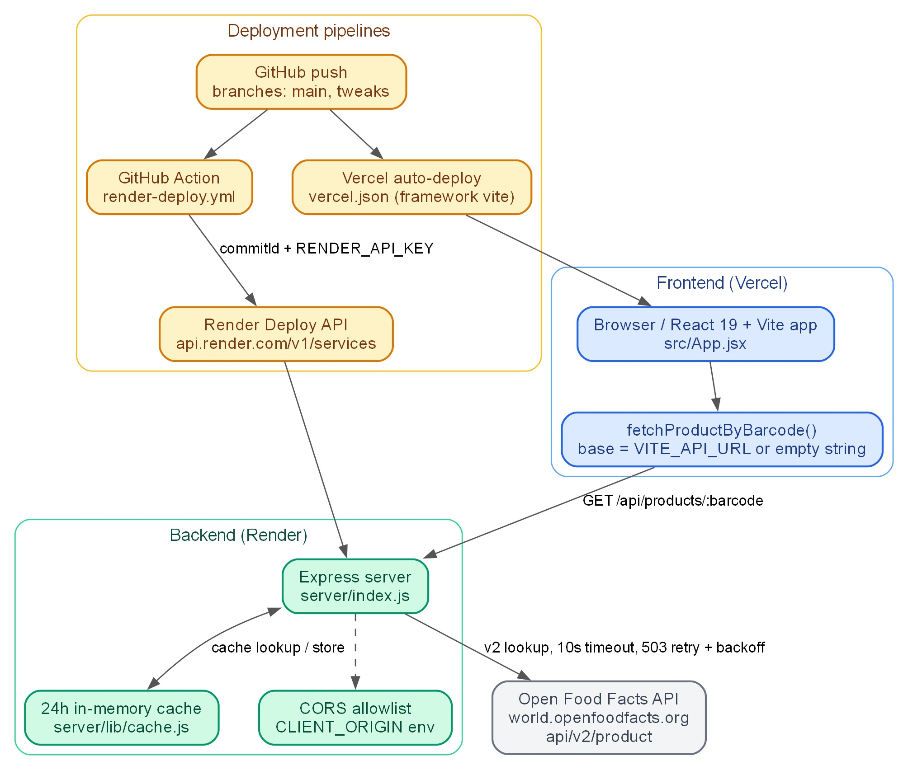
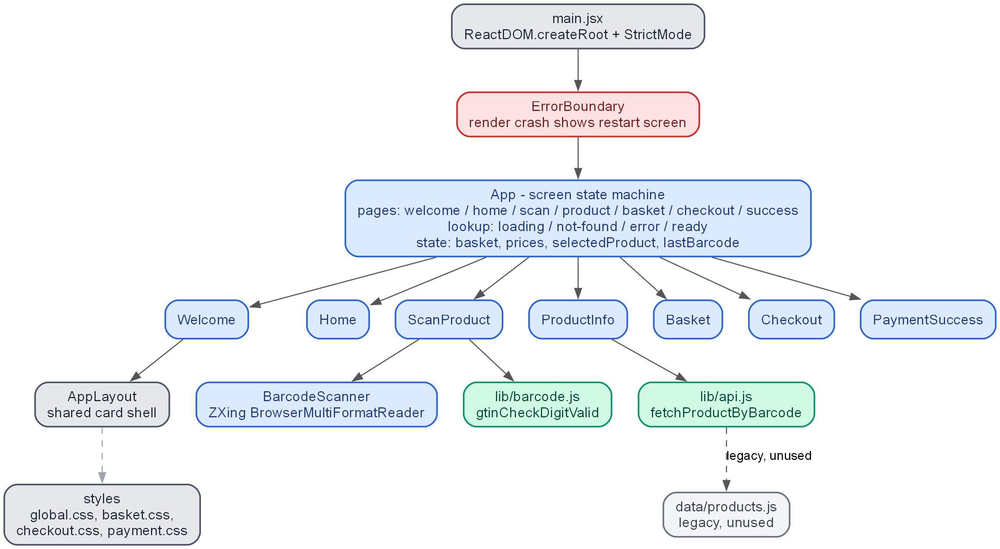
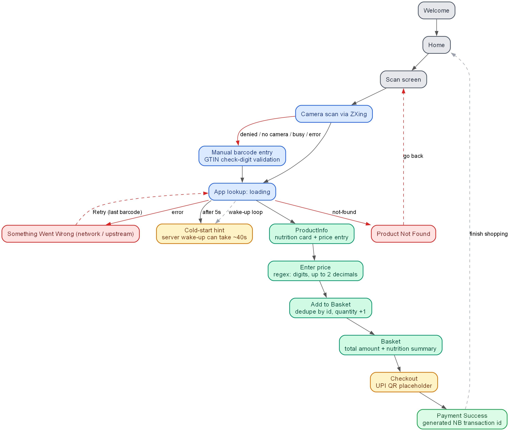
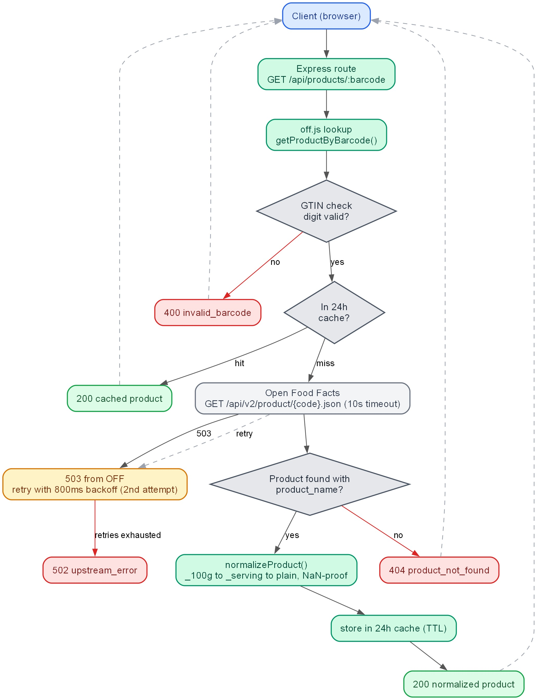
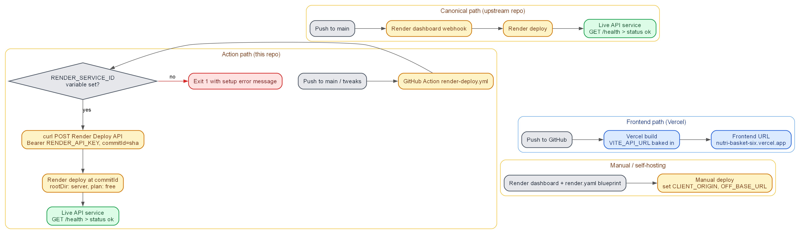

# NutriBasket — Final Year Project Report (Working Draft)

> This is the working draft of the group project report. Group/college-specific fields are marked with `[PLACEHOLDER]` and must be filled before submission. All figures are embedded directly in this report as JPG images (in `assets/figures/`, generated with Graphviz — see `assets/figures/render.py`); no external documents are needed. Screenshots marked `[INSERT SCREENSHOT]` must be captured from the live app.
>
> **Suggested Word formatting (per standard B.Tech guidelines):** Times New Roman 12 pt body, 1.5 line spacing, 1-inch margins, justified text; chapter titles 16 pt bold; figure captions below figures, table captions above tables; page numbers bottom center (Roman numerals for front matter, Arabic from Chapter 1); IEEE numbered citations in square brackets.

---

# TITLE PAGE (template)

**PROJECT TITLE:** NutriBasket — A Barcode-Scanning Nutrition Assistant for Smart Grocery Shopping

**Submitted by:**
| Name | Roll Number |
| --- | --- |
| [Student 1 Name] | [Roll No] |
| [Student 2 Name] | [Roll No] |
| [Student 3 Name] | [Roll No] |

**Under the Guidance of:** [Guide Name, Designation]

[Department Name], [College / Institute Name]
[Academic Year 20XX – 20XX]

---

# DECLARATION (template)

We hereby declare that the project report entitled "NutriBasket — A Barcode-Scanning Nutrition Assistant for Smart Grocery Shopping", submitted in partial fulfilment of the requirements for the degree of Bachelor of Technology, is our original work and has not been submitted elsewhere for any degree or diploma.

**Signature:** ______________  **Date:** ______________

---

# CERTIFICATE (template)

This is to certify that the project report entitled "NutriBasket — A Barcode-Scanning Nutrition Assistant for Smart Grocery Shopping" has been prepared by [Student Names] under my supervision and guidance in partial fulfilment of the requirements for the award of the Bachelor of Technology degree.

**Signature of Supervisor:** ______________  **Date:** ______________

---

# ACKNOWLEDGEMENT

We would like to express our sincere gratitude to our project guide, [Guide Name], for their continuous guidance and support. We also thank [HoD Name] and the faculty of the [Department Name] for providing the necessary facilities. Finally, we thank our families and friends for their encouragement throughout the project.

---

# ABSTRACT

NutriBasket is a web-based grocery and nutrition assistant that lets users scan a product barcode with their phone camera, retrieve that product's nutrition information (calories, protein, carbohydrates, and fat) from the Open Food Facts database, and build a nutrition-aware shopping basket with running totals. The motivation behind the project is the difficulty consumers face in comparing the nutritional value of packaged foods at the point of purchase: nutrition labels are dense, barcode numbers are meaningless to the eye, and existing grocery apps rarely combine scanning with nutrition tracking.

The system has two components. The frontend is a React 19 single-page application deployed on Vercel; it provides a real-time camera scanner built on the ZXing barcode-decoding library, a manual barcode entry fallback validated with a GTIN check-digit algorithm, and a seven-screen flow covering welcome, home, scanning, product details with user-entered session prices (INR), basket, simulated UPI checkout, and payment success. The backend is a Node.js/Express service deployed on Render that validates the barcode, queries the Open Food Facts API through a resilient client with timeout, retry, and a 24-hour in-memory cache, and returns a clean normalized product response with well-defined 400/404/502 error semantics. Deployment is fully automated: a GitHub Actions workflow triggers Render deploys on every push, and Vercel rebuilds the frontend automatically.

The project was verified end-to-end against live barcodes: a real product returns normalized nutrition data, an unknown barcode returns a not-found state, and invalid input is rejected before reaching the basket. A price-validation bug that could poison basket totals with NaN was identified and fixed, and the UI was hardened with an error boundary, a cold-start hint for the free-tier backend, and a CORS diagnosis note. Future work includes persistence via a database, automated tests, AI-based nutrition scoring, and a real UPI payment flow.

**Keywords:** barcode scanning, nutrition, Open Food Facts, ZXing, React, Express, GTIN, PWA-style web app

---

# TABLE OF CONTENTS (outline — regenerate with page numbers in Word)

| Section | Page |
| --- | --- |
| Title Page | i |
| Declaration | ii |
| Certificate | iii |
| Acknowledgement | iv |
| Abstract | v |
| List of Figures | vi |
| List of Tables | vii |
| Chapter 1: Introduction | 1 |
| Chapter 2: Literature Review | 4 |
| Chapter 3: System Analysis and Requirements | 9 |
| Chapter 4: System Design | 14 |
| Chapter 5: Implementation | 20 |
| Chapter 6: Testing and Results | 27 |
| Chapter 7: Conclusion and Future Scope | 32 |
| References | 34 |
| Appendix A: Test Cases | 36 |
| Appendix B: Deployment Configuration | 38 |

# List of Figures

| Figure | Title | Source |
| --- | --- | --- |
| Fig. 1.1 | NutriBasket banner | `assets/banner.gif` |
| Fig. 4.1 | System architecture (frontend, backend, OFF, deployments) | §4.1 (fig-4-1.jpg) |
| Fig. 4.2 | Frontend component tree | §4.2 (fig-4-2.jpg) |
| Fig. 4.3 | User workflow with fallback paths | §4.2 (fig-4-3.jpg) |
| Fig. 4.4 | Backend API sequence diagram | §4.3 (fig-4-4.jpg) |
| Fig. 4.5 | Deployment lifecycle | §4.5 (fig-4-5.jpg) |
| Fig. 5.1 | [INSERT SCREENSHOT] Scan screen with camera frame and manual entry form | — |
| Fig. 5.2 | [INSERT SCREENSHOT] Product detail with nutrition grid and price entry | — |
| Fig. 5.3 | [INSERT SCREENSHOT] Basket with nutrition totals | — |
| Fig. 5.4 | [INSERT SCREENSHOT] Checkout and payment success screens | — |

# List of Tables

| Table | Title |
| --- | --- |
| Table 2.1 | Comparison of existing nutrition/barcode applications |
| Table 3.1 | Functional requirements |
| Table 3.2 | Non-functional requirements |
| Table 3.3 | Use-case summary |
| Table 4.1 | API endpoint reference |
| Table 5.1 | Technology stack |
| Table 6.1 | Test cases and results |
| Table 6.2 | Verification results against live backend |

---

# Chapter 1: Introduction

## 1.1 Background

Diet-related non-communicable diseases such as obesity, diabetes, and cardiovascular conditions are strongly influenced by the nutritional quality of packaged food [1]. Consumers, however, struggle to act on this information at the moment of purchase. Nutrition labels are dense and difficult to compare across products, and the barcode printed on every package — though universally present — carries no human-readable meaning. A barcode is simply an identifier; turning it into useful nutrition information requires a lookup service.

Smartphone cameras have made it possible to scan barcodes instantly, and public open datasets such as Open Food Facts [2] provide free, crowd-sourced nutrition data for millions of packaged products worldwide. The combination of camera-based scanning, a lookup API, and a shopping-basket interface can therefore move nutrition awareness from the label to the actual shopping experience.

## 1.2 Problem Statement

Consumers cannot easily determine the nutritional value of packaged food while shopping. Existing approaches have significant drawbacks:

- Reading and comparing nutrition labels by hand is slow and error-prone, especially for calories, protein, carbs, and fat across multiple brands.
- Most grocery apps are built around ordering, not nutrition awareness, and do not connect a scanned barcode to nutrition data.
- Nutrition-tracking apps require manual product search or manual data entry, which users abandon after a few uses.
- Price information is not available in nutrition databases, so nutrition and cost cannot be compared together in one flow.

The project addresses this by building a web application that turns a barcode scan into an immediate nutrition summary and lets the user combine nutrition totals with a priced basket.

## 1.3 Objectives

1. Develop a camera-based barcode and QR code scanner that works in mobile browsers.
2. Provide a manual barcode entry fallback with GTIN check-digit validation for cases where scanning fails.
3. Build a backend service that fetches and normalizes product nutrition data from the Open Food Facts API.
4. Display per-product nutrition information (calories, protein, carbs, fat) with user-entered prices.
5. Maintain a basket with running nutrition and cost totals through a simulated checkout flow.
6. Deploy the application end-to-end with automated deployment pipelines and verify it against live data.

## 1.4 Scope and Limitations

**In scope:** scanning and manual entry; nutrition lookup; priced basket; simulated UPI checkout; responsive mobile-first UI; automated deployment; error handling.

**Out of scope (current phase):** user accounts and persistence (basket is session-only); real payment gateway integration; AI-based food recognition; nutrition scoring/recommendations.

**Limitations:** prices are user-entered per session because Open Food Facts does not carry price data; the free-tier backend sleeps after ~15 minutes of inactivity (cold start ~40 s); the camera needs a secure context (HTTPS); nutrition data depends on the coverage and quality of the Open Food Facts dataset.

## 1.5 Organisation of the Report

Chapter 2 reviews existing systems and the technologies used. Chapter 3 analyses requirements and feasibility. Chapter 4 presents the system design. Chapter 5 describes the implementation. Chapter 6 reports testing and results. Chapter 7 concludes and lists future work.

---

# Chapter 2: Literature Review

## 2.1 Existing Systems

| Application | Approach | Strengths | Limitations |
| --- | --- | --- | --- |
| MyFitnessPal / FatSecret | Manual food search + database | Large food databases, tracking features | Manual entry friction; no in-store scanning focus |
| Barcode scanner apps (general) | Scan → generic product info | Fast scan | Rarely nutrition-focused; often ad-supported |
| BigBasket / Amazon Fresh | Shopping apps with nutrition tabs | Integrated shopping | Nutrition secondary to ordering; no independent scan flow |
| Open Food Facts mobile app | Scan → open dataset lookup | Free, open, huge dataset | Standalone app; no basket/shopping flow |

**Gap:** no lightweight web app combines an open-data nutrition lookup with a camera scanner, user-priced basket, and checkout flow, deployable by anyone with the repository.

## 2.2 Barcode Technology

GTIN (Global Trade Item Number) barcodes — EAN-13, EAN-8, UPC-A, and ITF-14 — encode a product identifier of 8, 12, 13, or 14 digits whose final digit is a check digit computed with alternating weights of 3 and 1 from the right [3]. The project implements this check-digit validation both in the browser (client) and on the server, so malformed codes are rejected early.

## 2.3 Open Food Facts API

Open Food Facts [2] is a free, open, collaborative database of food products contributed by volunteers, accessible through a REST API at `https://world.openfoodfacts.org/api/v2/product/{code}.json` with no API key required. The v2 endpoint returns fields including `product_name`, `brands`, `image_front_url`, `quantity`, and a `nutriments` block with per-100 g and per-serving values. A known quirk is that the API returns `status: 1` with an empty product for unknown codes, so the backend guards on the presence of `product_name` to distinguish real 404s.

## 2.4 Web Technologies

- **React 19 + Vite 8:** component-based UI with fast dev server and optimized production builds [4].
- **ZXing (`@zxing/browser`):** open-source barcode/QR decoding for live camera feeds in browsers, using `getUserMedia` under a secure context [5].
- **Node.js + Express:** minimal, widely used HTTP server framework; chosen over serverless functions because the backend keeps a long-lived in-memory cache and performs retry/timeout logic against an upstream API [6].
- **CSS custom properties:** the emerald "premium" theme is defined once in `global.css` and shared across screens.

## 2.5 Research Gap and Justification

The review shows that while scanning libraries and nutrition datasets each exist, the integration — camera scan → normalized nutrition lookup → priced basket → checkout — is not available as an open, self-deployable web application. This project fills that gap, and its architecture (thin frontend, resilient caching backend) is deliberately simple enough to be reproduced and extended by a student team.

---

# Chapter 3: System Analysis and Requirements

## 3.1 Feasibility Study

- **Technical feasibility:** all components are free, well documented, and browser/standards based; Open Food Facts requires no key; both hosting platforms offer free tiers.
- **Operational feasibility:** the app runs entirely in a browser; no installation; works on any modern phone with a camera over HTTPS.
- **Economic feasibility:** zero cost at this phase (Vercel free tier, Render free tier, no paid APIs).

## 3.2 Functional Requirements

| ID | Requirement | Priority |
| --- | --- | --- |
| FR1 | User can start/stop the camera scanner on demand | High |
| FR2 | User can scan EAN/UPC/QR codes from a live camera feed | High |
| FR3 | Camera permission denial, missing camera, busy camera and generic failures are handled with friendly messages and retry | High |
| FR4 | User can enter a barcode manually with client- and server-side GTIN validation | High |
| FR5 | The system fetches product name, brand, image, and nutrition from Open Food Facts via the backend | High |
| FR6 | The system displays product nutrition with a user-entered price; add-to-basket is disabled until a valid price is entered | High |
| FR7 | The basket supports add, quantity change, remove, and running nutrition/cost totals | High |
| FR8 | Checkout shows an order summary with a simulated UPI QR payment screen and a receipt with a transaction id | Medium |
| FR9 | The system distinguishes not-found and backend-error states with retry options | Medium |
| FR10 | The system shows a hint when a lookup takes long (backend cold start) | Low |

## 3.3 Non-Functional Requirements

| Category | Requirement |
| --- | --- |
| Performance | Lookup response < 2 s for cached products; cold start acceptable (~40 s) with user-visible hint; bundle size monitored (~687 KB due to ZXing) |
| Reliability | Upstream retry (2 attempts, 800 ms backoff), 10 s timeout, 24 h cache; error boundary prevents white-screen crashes |
| Security | CORS restricted to `CLIENT_ORIGIN`; helmet security headers; barcode validation server-side; secrets kept out of the repository |
| Usability | Mobile-first, camera + manual entry fallback, clear error states, INR pricing |
| Maintainability | Plain JavaScript, single-file screens, linted with Oxlint, documented README and diagram document |

## 3.4 Use-Case Summary

| Actor | Use case |
| --- | --- |
| Shopper | Scan product barcode; enter barcode manually; view nutrition and enter price; add to basket; adjust basket; checkout; view receipt |
| System (backend) | Validate barcode; check cache; query Open Food Facts; normalize response; return 200/400/404/502 |
| Developer | Deploy via GitHub push (auto-deploy); configure env vars; run locally |

---

# Chapter 4: System Design

## 4.1 Overall Architecture

The system follows a classic three-tier web architecture: a browser frontend (Vercel), an Express backend (Render), and the external Open Food Facts API. The backend is the only component that talks to Open Food Facts. CORS is scoped to the frontend origin via the `CLIENT_ORIGIN` environment variable, and a 24-hour in-memory cache absorbs repeated lookups. The overall architecture is shown in **Fig. 4.1**.

**Fig. 4.1 — System architecture (frontend, backend, Open Food Facts, deployment pipelines).**

## 4.2 Frontend Design

- **State machine:** `App.jsx` routes between seven pages — welcome, home, scan, product, basket, checkout, success — with a `lookup` state of loading/not-found/error/ready and session state for `basket`, `prices`, `selectedProduct`, and `lastBarcode`.
- **Scanner:** `BarcodeScanner.jsx` uses ZXing's `BrowserMultiFormatReader` with a status machine (idle/starting/scanning/denied/no-camera/busy/error), 1.5 s duplicate-scan dedupe, and StrictMode-safe stream cleanup. Camera starts only on user tap (iOS autoplay quirk).
- **Price entry:** `ProductInfo.jsx` validates input with `/^\d+(\.\d{1,2})?$/` (plain positive amount, ≤ 2 decimals) before enabling "Add to Basket", preventing NaN from reaching totals.
- **Resilience:** a top-level `ErrorBoundary` shows a restart screen instead of a white page; a 5-second timer surfaces a cold-start hint during lookups.
- The frontend component tree is shown in **Fig. 4.2** and the full user workflow (happy path and fallbacks) in **Fig. 4.3**.

**Fig. 4.2 — Frontend component tree.**

**Fig. 4.3 — User workflow with fallback paths.**

## 4.3 Backend Design

The endpoints are listed in **Table 4.1**, and the full request lifecycle is shown in **Fig. 4.4**.

| Method | Path | Behavior |
| --- | --- | --- |
| GET | `/` | Service info JSON listing available endpoints |
| GET | `/health` | `{ "status": "ok" }` — used by Render's health check |
| GET | `/api/products/:barcode` | Validates GTIN (8–14 digits, check digit); cache lookup; Open Food Facts fetch via `fetchWithRetry` (10 s timeout, 503 retry with 800 ms backoff, 2 attempts); `normalizeProduct` maps the v2 response (`_100g` → `_serving` → plain fallbacks, NaN-proof zero defaults); shell-product guard on `product_name`. Returns `400 invalid_barcode`, `404 product_not_found`, `502 upstream_error`, or `200` normalized product `{ id, barcode, name, brand, image_url, pack_quantity, price_inr, calories, protein, carbs, fat }` |

**Fig. 4.4 — Backend API sequence diagram.**

## 4.4 Data Flow

Scan or manual entry → GTIN validation (client) → `GET /api/products/:barcode` → GTIN validation (server) → 24 h cache → Open Food Facts → normalize → 200 response → product screen → price input → basket with totals → checkout → receipt. Not-found and error paths route back to the scan screen with retry.

## 4.5 Deployment Design

Two independent pipelines (see **Fig. 4.5**):

- **Backend:** push to `main`/`tweaks` → GitHub Actions workflow (`render-deploy.yml`) guards on the `RENDER_SERVICE_ID` repo variable, then POSTs to the Render Deploy API with `RENDER_API_KEY` and `commitId` → Render builds and deploys; `/health` is the health check. A canonical alternative: connecting the repo in the Render dashboard registers a native webhook (no secrets).
- **Frontend:** Vercel auto-builds on push with `VITE_API_URL` baked in at build time.
- Self-hosting: deploy the backend manually from the Render dashboard using the `render.yaml` blueprint (set `CLIENT_ORIGIN`; optionally `OFF_BASE_URL`), then import the frontend repository into Vercel with `VITE_API_URL` set to the new backend URL. Full steps are in the repository README.

**Fig. 4.5 — Deployment lifecycle.**

---

# Chapter 5: Implementation

## 5.1 Technology Stack

| Layer | Technology |
| --- | --- |
| Frontend | React 19.2, Vite 8.1, `@zxing/browser` 0.2.1, plain CSS (emerald theme), Oxlint |
| Backend | Node.js 18+, Express 4.21, cors, helmet, dotenv |
| Data | Open Food Facts API v2; 24 h in-memory cache (no database) |
| Hosting | Vercel (frontend), Render free tier (backend), GitHub Actions (deploy) |
| Version control | Git, branch `tweaks`, fork-based workflow with PR to upstream |

## 5.2 Development Phases

- **Phase A — Quick fixes:** repaired the dead Home "Checkout" button; unified the basket/checkout/payment CSS onto the emerald theme; deleted unused Vite template files; removed an unused dependency; added `vercel.json`, `.gitignore` hygiene, and a working README.
- **Phase B — Real scanning + backend:** built the ZXing camera scanner with full error states; manual entry with GTIN check-digit validation (client and server); Express backend with OFF lookup, retries, timeout, cache, and normalization; wired the frontend through a Vite dev proxy and `VITE_API_URL`; deployed to Vercel and Render.
- **Phase C — Bug fixes + hardening:** fixed the price-input NaN poisoning of basket totals; added the error boundary, the cold-start hint, a CORS diagnosis console note, and secret-file `.gitignore` rules.

## 5.3 Key Modules

- **`src/components/scanner/BarcodeScanner.jsx`** — camera lifecycle, decode callback, dedupe, cleanup on unmount (StrictMode-safe).
- **`src/lib/barcode.js` / `server/lib/off.js` (GTIN validation)** — lengths 8/12/13/14, alternating 3/1 weights from the right; shared logic concept on client and server.
- **`server/lib/off.js`** — `fetchWithRetry` and `normalizeProduct` (with `_100g` → `_serving` → plain fallbacks).
- **`src/App.jsx`** — screen router, lookup flow, `prices` and `basket` session state.
- **`.github/workflows/render-deploy.yml`** — auto-deploy via Render API with `commitId` and guard step.

## 5.4 Deployment Configuration

- `render.yaml` blueprint: web service `nutribasket-api`, rootDir `server`, free plan, `npm install` / `npm start`, `/health` health check, `CLIENT_ORIGIN` env var.
- `vercel.json`: `{ "framework": "vite" }`; `VITE_API_URL` = backend URL (build-time).
- GitHub Actions secrets/variables: `RENDER_API_KEY` (secret), `RENDER_SERVICE_ID` (variable).
- See Appendix B for full configuration listings.

---

# Chapter 6: Testing and Results

## 6.1 Testing Approach

Testing was manual and verification-driven: linting (Oxlint, 0 errors), production builds, live API checks with `curl`, and browser-level testing of the scanner, manual entry, and error states. No automated test suite is in place (identified as future work).

## 6.2 Test Cases and Results

| ID | Test | Input | Expected | Result |
| --- | --- | --- | --- | --- |
| T1 | Valid product lookup | barcode `3017624010701` (Nutella) | 200, normalized product with calories/protein/carbs/fat | PASS |
| T2 | Unknown product | barcode `8901234567890` | 404 `product_not_found`; UI not-found screen | PASS |
| T3 | Invalid barcode (bad check digit / letters) | e.g. `123` or `abcdef` | 400 `invalid_barcode`; client validation blocks entry | PASS |
| T4 | Price validation | `e`, `1e5`, `1.2.3`, `-5` | Button disabled; no NaN in totals | PASS |
| T5 | Camera permission denied | user denies prompt | "Camera access blocked" + manual fallback | PASS |
| T6 | No camera / busy camera | device without camera | "No camera found"/"Camera is busy" + retry | PASS |
| T7 | Cold start | idle > 15 min then scan | hint shown after ~5 s; lookup completes (~40 s) | PASS |
| T8 | Health endpoint | `GET /health` | 200 `{ "status": "ok" }` | PASS |
| T9 | Service root | `GET /` | 200 service-info JSON | PASS |
| T10 | Basket totals | mix of items, quantities changed | correct cost + nutrition totals | PASS |

## 6.3 Verification against the Live Deployment

| Check | URL | Result |
| --- | --- | --- |
| Frontend reachable | `https://nutri-basket-six.vercel.app` | 200 |
| Backend root | `https://nutribasket-api.onrender.com/` | 200 service info |
| Health | `…/health` | 200 `{"status":"ok"}` |
| Product lookup | `…/api/products/3017624010701` | 200 normalized product |
| Unknown barcode | `…/api/products/8901234567890` | 404 |
| CORS header | response from backend | restricted to frontend origin |

## 6.4 Discussion

The core flow — scan → fetch → display → add to basket — works end-to-end with live data. The most significant incident during development was a price-input bug that propagated NaN into every basket total; it was caught by review and fixed in Phase C, which demonstrates the value of the manual verification loop given the absence of automated tests. Known remaining trade-offs: free-tier cold start, bundle size (~687 KB) due to ZXing, session-only persistence, and simulated payment.

---

# Chapter 7: Conclusion and Future Scope

## 7.1 Conclusion

NutriBasket achieves all six stated objectives: a mobile-browser camera scanner, a validated manual fallback, a resilient Open Food Facts backend, nutrition display with user pricing, a nutrition-aware priced basket through simulated checkout, and automated deployment verified against live data. The architecture deliberately separates a thin frontend from a caching backend, keeping the system simple, free to run, and easy to reproduce. The project demonstrates how open data, browser camera APIs, and free hosting tiers can combine into a practical nutrition-shopping tool.

## 7.2 Future Scope

1. **Persistence and accounts** — PostgreSQL/Supabase for baskets, prices, and scan history across sessions.
2. **Automated tests** — unit tests for GTIN validation, API client, and backend endpoints; an end-to-end scan → fetch → basket flow test.
3. **State management** — migrate basket/session state to Zustand as screens multiply.
4. **Real payment** — replace the simulated UPI QR with a real payment gateway.
5. **Performance** — lazy-load the scanner to cut the ~687 KB initial bundle.
6. **AI nutrition scoring** — nutrition quality scoring and recommendations per the IMPROVEMENT.md plan.
7. **Mobile UX** — front/rear camera toggle and torch control for low light.

---

# REFERENCES (IEEE style)

[1] World Health Organization, "Healthy diet," WHO fact sheet, 2020. [Online]. Available: https://www.who.int/news-room/fact-sheets/detail/healthy-diet. [Accessed: Aug. 2026].

[2] Open Food Facts, "Open Food Facts API v2," 2026. [Online]. Available: https://world.openfoodfacts.org/data. [Accessed: Aug. 2026].

[3] GS1, "GTIN general specifications," GS1, 2021. [Online]. Available: https://www.gs1.org/standards/barcodes. [Accessed: Aug. 2026].

[4] Meta Open Source, "React documentation," 2026. [Online]. Available: https://react.dev. [Accessed: Aug. 2026].

[5] ZXing Project, "ZXing — barcode scanning library for Java, Android and platform ports," 2026. [Online]. Available: https://github.com/zxing/zxing. [Accessed: Aug. 2026].

[6] Express.js, "Express — Node.js web application framework," 2026. [Online]. Available: https://expressjs.com. [Accessed: Aug. 2026].

[7] Vercel, "Vite documentation / Vercel deployment," 2026. [Online]. Available: https://vercel.com/docs. [Accessed: Aug. 2026].

[8] Render, "Deploy hooks and web services documentation," 2026. [Online]. Available: https://render.com/docs. [Accessed: Aug. 2026].

---

# APPENDIX A — Test Barcodes

| Barcode | Expected result |
| --- | --- |
| `3017624010701` | 200 — Nutella (valid EAN-13) |
| `8901234567890` | 404 — unknown product |
| `123` | 400 — too short / invalid |
| `890100000001`–`890100000005` | legacy demo products in `src/data/products.js` (not in OFF necessarily) |

# APPENDIX B — Deployment Configuration

**`render.yaml`** — web service `nutribasket-api`, `runtime: node`, `rootDir: server`, `plan: free`, build `npm install`, start `npm start`, `healthCheckPath: /health`, env `CLIENT_ORIGIN`.

**`.github/workflows/render-deploy.yml`** — triggers on push to `main`/`tweaks`; fails loudly if `RENDER_SERVICE_ID` unset; POSTs to `https://api.render.com/v1/services/${{ vars.RENDER_SERVICE_ID }}/deploys` with `Authorization: Bearer ${{ secrets.RENDER_API_KEY }}` and body `{"clearCache":"do_not_clear","commitId":"${{ github.sha }}"}`.

**Environment variables** — frontend: `VITE_API_URL` (build-time); backend: `PORT`, `CLIENT_ORIGIN`, `OFF_BASE_URL`.
